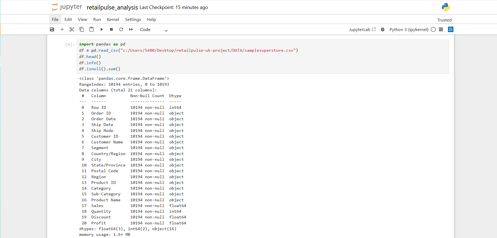
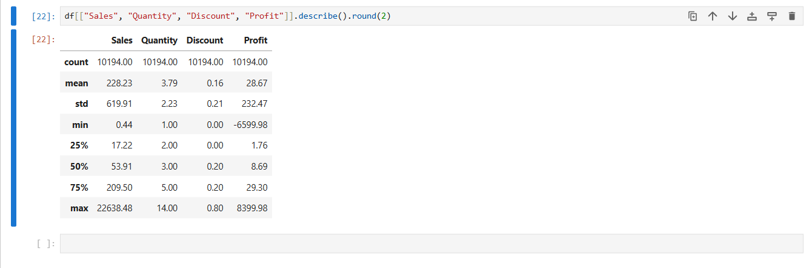
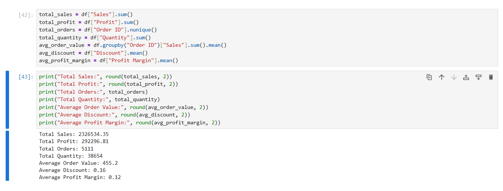
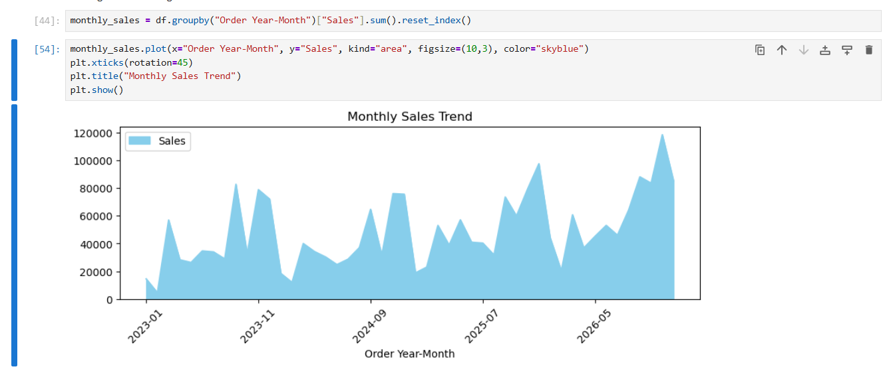
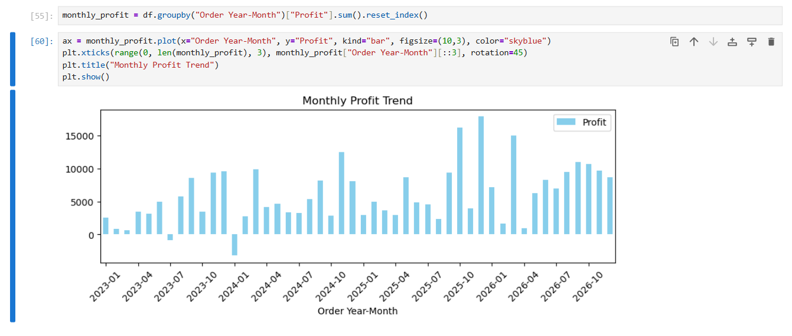
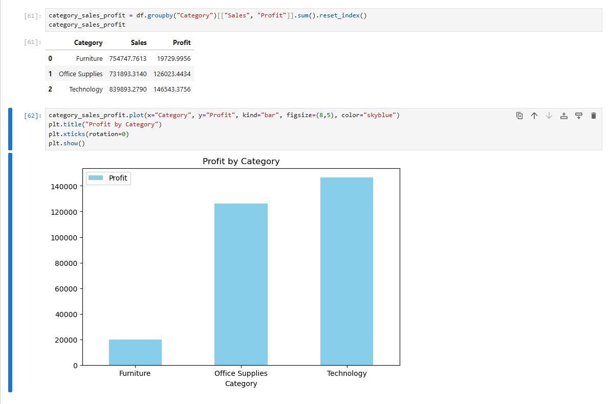
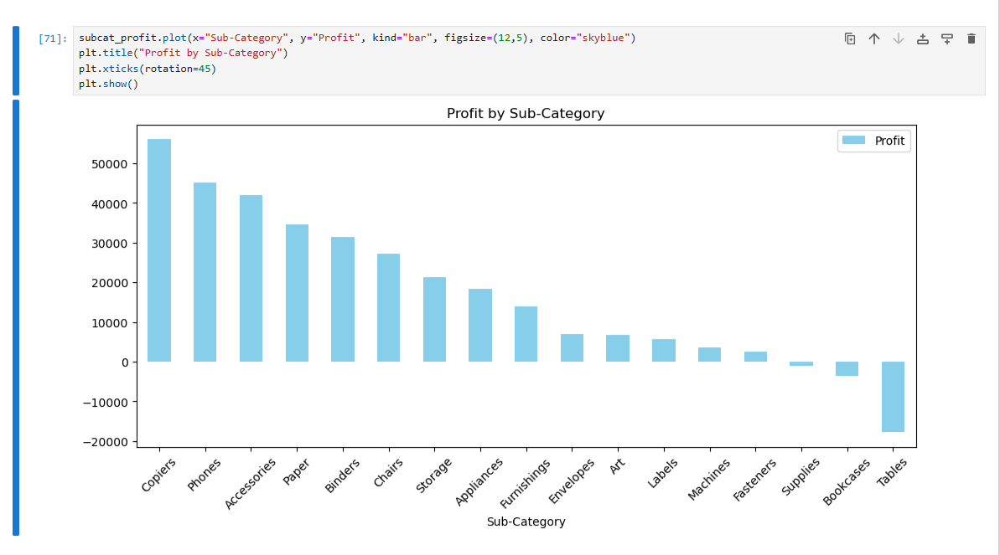
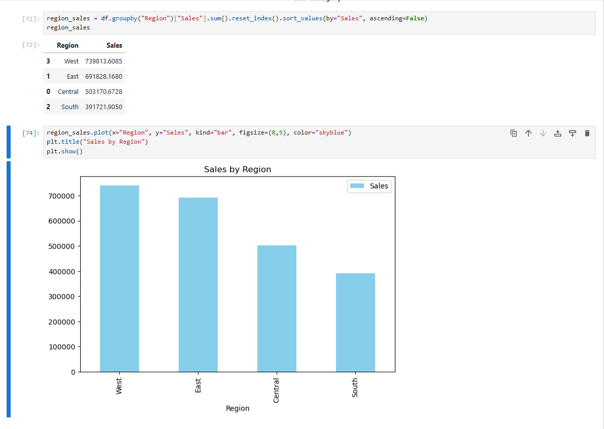
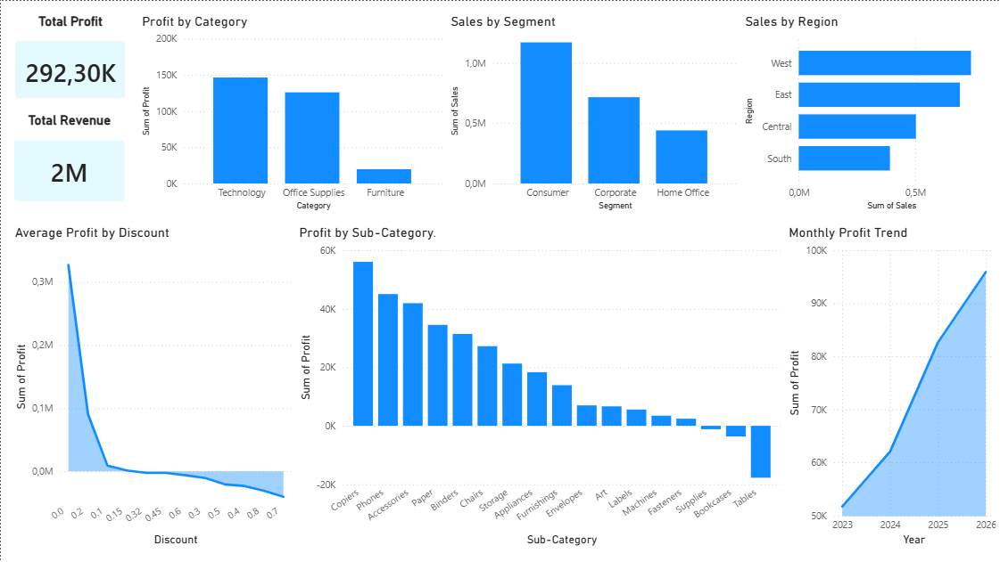

# RetailPulse Sales Analytics

## Project Overview
RetailPulse Sales Analytics is an end-to-end retail analytics project built to analyse sales performance, profitability, regional trends, and product category results. The project demonstrates practical skills in Python, Pandas, Jupyter Notebook, Power BI, and GitHub.

## Business Objective
The goal of this project was to analyse retail transaction data and identify key business insights related to:
- total sales performance
- profitability
- category and sub-category performance
- regional sales distribution
- customer segment contribution
- discount impact on profitability

## Tools Used
- Python
- Pandas
- Jupyter Notebook
- Power BI
- GitHub

## Dataset
The project uses the Sample Superstore dataset, which contains order-level data including:
- order details
- customer segment
- category and sub-category
- sales
- quantity
- discount
- profit
- region

## Project Workflow
Raw CSV dataset → Python data loading → data checks → feature engineering → KPI calculation → exploratory analysis → cleaned dataset export → Power BI dashboard

---

## 1. Data Loading and Initial Checks
The dataset was imported into Jupyter Notebook using Pandas.  
At this stage, the first rows, dataset structure, and missing values were reviewed.

What was checked:
- dataset loading
- first rows preview
- column structure
- data types
- missing values



---

## 2. Numerical Summary
A descriptive statistical summary was created for the main numerical columns:
- Sales
- Quantity
- Discount
- Profit

This helped identify the overall range of values, the presence of loss-making transactions, and the distribution of discounts.



---

## 3. KPI Calculation
The main business KPIs were calculated in Python.

### Key KPIs
- **Total Sales:** 2,326,534.35
- **Total Profit:** 292,296.81
- **Total Orders:** 5,111
- **Total Quantity Sold:** 38,654
- **Average Order Value:** 455.20
- **Average Discount:** 16%
- **Average Profit Margin:** 12.22%

These KPIs show that the business is profitable overall, but performance differs across products and business areas.



---

## 4. Monthly Sales Trend
Monthly sales were analysed to identify revenue dynamics over time.

This step helped reveal how sales changed across different months and supported trend evaluation.



---

## 5. Monthly Profit Trend
Monthly profit was analysed to identify strong and weak periods in terms of profitability.

This helped evaluate not only revenue generation, but also business efficiency over time.



---

## 6. Profit by Category
Category-level analysis showed which major product groups contributed most to total profit.

**Key finding:**  
Technology was the most profitable category.



---

## 7. Profit by Sub-Category
Sub-category analysis provided a deeper view of product-level performance.

**Key finding:**  
Tables was the weakest-performing sub-category and generated a loss.



---

## 8. Sales by Region
Regional analysis helped identify which geographical area generated the highest sales.

**Key finding:**  
West was the top-performing region by sales.



---

## 9. Power BI Dashboard
After the Python analysis was completed, a cleaned dataset was exported and used in Power BI to build an interactive dashboard.

The dashboard includes:
- KPI cards
- sales by segment
- sales by region
- monthly progfit
- profit by discount
- profit by category



---

## Key Business Insights
Based on the analysis, the following conclusions were identified:

1. Technology was the most profitable category.
2. Tables was the weakest sub-category and produced a significant loss.
3. West was the strongest region by sales and also performed strongly in profit.
4. The business generated strong total sales and remained profitable overall.
5. The average discount level was relatively high, meaning discount strategy should be monitored carefully.
6. Some product groups and strategies contribute much more effectively to profit than others.

---

## Recommendations
Based on the results, the business could consider:
- increasing focus on high-performing categories such as Technology
- reviewing pricing and discount strategy for Tables
- replicating successful sales practices from the West region
- monitoring discount levels more carefully to protect margins

---

## Project Structure
```text
retailpulse-sales-analytics/
│
├── data/
│   ├── samplesuperstore.csv
│   └── clean_superstore.csv
│
├── notebooks/
│   └── retailpulse_analysis.ipynb
│
├── dashboard/ or dashboards/
│   └── retailpulse_dashboard.pbix
│
├── images/
│   ├── 01_data_loading_and_checks.png
│   ├── 02_numerical_summary.png
│   ├── 03_kpi_output.png
│   ├── 04_monthly_sales_trend.png
│   ├── 05_monthly_profit_trend.png
│   ├── 06_profit_by_category.png
│   ├── 07_profit_by_subcategory.png
│   ├── 08_sales_by_region.png
│   └── 09_powerbi_dashboard.png
│
└── README.md